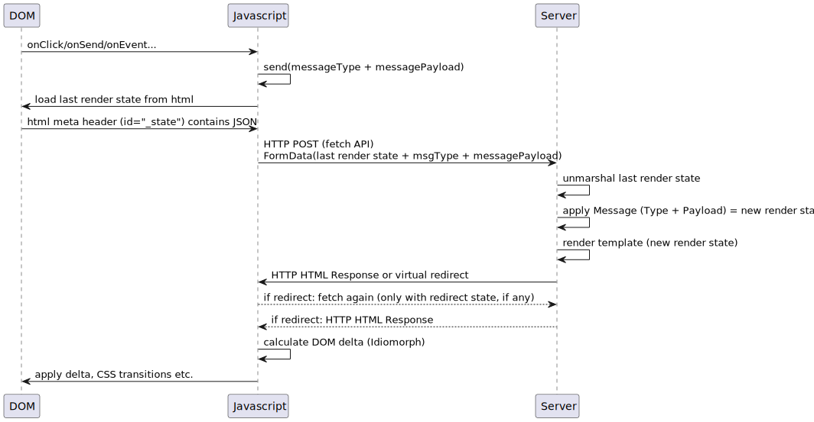

# hg
hg is a small **h**tml library for **g**o, which provides some comforting utilities and encourages an event based html SSR (server-side rendering) flow style.
It is compatible with the standard library and can be integrated into any router and http server setup.

## Influenced by

This library has been influenced by the following patterns, theories and technologies:
* The [elm](https://elm-lang.org/) programming language and its state and message system (see `hg.Update`)
* The [Vue component and slots](https://vuejs.org/guide/components/slots.html#slot-content-and-outlet) mechanism (see the template helper functions `map`, `html`, `str` and `evaluate`)
* The [Vue hydration](https://vuejs.org/guide/scaling-up/ssr.html) concept (see [Idiomorph](https://github.com/bigskysoftware/idiomorph))
* The [Vue HTML5 history mode](https://router.vuejs.org/guide/essentials/history-mode.html#html5-mode) (see the js-helper library)
* The [Vue hot reload](https://vue-loader.vuejs.org/guide/hot-reload.html) (see the hotReload js helper function and [reflex](https://github.com/cespare/reflex) or an [IntelliJ-Plugin](https://youtrack.jetbrains.com/issue/GO-11119#focus=Comments-27-4901631.0-0))
* Spring Boot [Thymeleaf Redirect](https://www.baeldung.com/spring-redirect-and-forward) (see `hg.Redirect`)
* [Blazor](https://learn.microsoft.com/de-de/aspnet/core/blazor/?view=aspnetcore-7.0) (but hg is cheaper and stateless. Instead of allocating server resources and bind them to permanent websocket connections, the page state is offloaded and embedded into the delivered page)
* The [htmx](https://htmx.org/docs/#introduction) declarative annotations.

## Conceptual data flow



## Introduced tags

Like htmx, hg provides a bunch of tokens to annotate the html to make it interactive.

### hg-hotreload
hg supports hot-reloading through a long-poll mechanism.
To enable, set the `hg-hotreload` attribute to the body tag.

Example, which polls the default endpoint `/version/poll`:
```html
<body hg-hotreload>
    {{template "page" .}}
</body>
```

Example, which polls a custom endpoint:
```html
<body hg-hotreload="/my/custom/poll/handler">
    {{template "page" .}}
</body>
```

### hg-event, hg-data and hg-trigger

To re-render a page, you have to tell hg what and when to send a message.
So first, take any Element and put an hg-event attribute on it, which must contain a string which matches the registered case in your page handler.
Internally, a normal javascript event listener is registered using the type declared in the attribute hg-trigger.

_Note:_ This behavior will change slightly to support more complex cases like delays and message cancellations.

In your page handler configure your message and model transformation:
```go
hg.Update(hg.Case("add", func(model PageState, msg AddEvent) PageState {
    model.Count += int(msg)
    return model
}))
```

Trigger the event as follows in your html template:
```html
<button hg-event="add" hg-data="2" hg-trigger="click">Your clicked sum is {{.Count}}</button>
```

Note, that the hg-event and hg-trigger attributes are obligatory.
The hg-data attribute is optional and depends on your interpretation of the message.

### Triggers

Currently, the following triggers are supported.

#### Default trigger events
By default, any trigger is treated as a javascript event type and registered as such.

#### Polling
You can trigger an event automatically, by using the `every Xs` syntax.
Note the magic `!refresh` event, which just issues an re-render request for the current page state.
This issues no additional page model update.

```html
<p hg-event="!refresh" hg-trigger="every 5s">Current Time: {{.Time}}</p>
```

### hg-href

To trigger the DOM merging for regular navigations, you can add the _hg-href_ attribute to any element.

```html
<button hg-href="/go/ahead?some=thing">Go ahead</button>
```

## Example

Take a look at the standalone [hg example project](https://github.com/worldiety/hg-example).

## Why?

At first, encouraging SSR in 2023 may seem to be out of time, however there is the interesting trend of all large SPA frameworks, to provide SSR concepts anyway, where the page is pre-rendered and delivered and hydrated at the client side, to get the best of both worlds.
On the other hand, most SPA applications are just pure technical overkill, because not a single unique advantage is used.
Take a look of this excerpt of possible features:

* Offline and Caching Support
* Complex interactive and responsive UI like Editors
* faster Response-Time, due to smaller requests (usually REST)
* Offloading Rendering to the Client
* enforces some kind of frontend-backend architecture (typically REST or graphql as a communication protocol)
* Optimizations only work effectively with a lot of handcrafted work, otherwise the result will usually contain everything at once
* complex and awesome UX

And, there are also a lot of disadvantages:

* SPA frameworks are generally incompatible across regular major version updates, which becomes really expensive over time
* SPA frameworks require an often used supply chain attack vector to be buildable at all, e.g. npm. There are regularly massive npm security flaws and compromised third party libraries, which are used without any actually benefit (left pad or is even/is odd anyone?)
* Today, search-engines support the execution of Javascript, but it is generally not compatible with the asynchronous workflow of SPA frameworks.
* Without transpilers and the usage of other languages like Typescript, maintaining larger projects is infeasible.
* Even though there have been millions of dollars and person hours already spend, Javascript has an unprofessional background without the possibility to detach from its past.
This still results in a lot of intransparent optimizations, compatibility shims and re-inventions to apply any sort of workarounds.
For example tree shaking (respective dead code elimination) and other compiler or link time optimizations are solved problems, which are well known and have been implemented more than 50 years ago for any reasonable language.
* You can optimize it with a lot of effort, but the page must first load (more or less) everything anyway.
* You have to create a REST API (or similar) without any actual need.
This means more work to implement and test, so its more expensive.
Also, creating meaningful APIs which are not just some repository CRUDs are not that easy.

Here we are.
Even though proposing to go back to SSR looks like a step backwards and may even cause the absence of a defined (RPC-)API, it looks like we can be optimistic regarding maintainability, when considering improvements in our understanding of software architecture patterns.
Our assumptions are (still to be proofed):

* faster time to market
* less expensive to develop
* less expensive to maintain
* more backend developers can be fullstack developers
* more than good enough for low-frequently used tools, especially for domain experts
* easier to debug and profile
* reliable and state-of-the-art compilers and toolings
* better architecture than the average mainstream SPA framework, especially when comparing with the typical CRUD API styles.
* no additional harm for the software architecture in general, due to layered architectures and the application of domain-driven design patterns.

